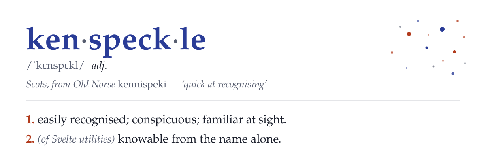

<picture>
	<source media="(prefers-color-scheme: dark)" srcset="docs/assets/banner-dark.svg">
	
</picture>

Svelte utilities you recognize at sight. One naming convention, no `use` prefix, attachments first-class.

> **Status:** pre-release. This README is the contract being built against; nothing is on npm yet.

## The sentence test

Every export earns its shape by being said aloud: _"I want a new \___."_

- "a new **finite state machine**" — speakable, and you drive it with methods → `new FiniteStateMachine()`
- "a new **element size**" — not a thing you ask for → `elementSize()`
- "a new **is idle**" — nonsense → `idle()`

Two rules fall out:

1. **Class** only when "new X" is speakable _and_ you drive it with methods. There are exactly two: `FiniteStateMachine` and `StateHistory`.
2. **Everything else is a camelCase function.** No `use` prefix — that's a React Hooks rule, and Svelte has no such rule. No `is` prefix either — predicates are bare words read as implicit questions: `mounted()`, `idle()`, `documentVisible()`. The question lives in the library, the answer in your variable: `const isMounted = mounted()`.

That's why the name. Kenspeckle things are known at sight; so is every export here. The word is the spec.

## Attachments, curried

Element-bound utilities are one name in two forms. Options only → returns an [attachment](https://svelte.dev/docs/svelte/@attach). Element first → the imperative helper, cleanup returned.

```svelte
<script>
	// same import, imperative
	const cleanup = clickOutside(node, () => close());
</script>

<div {@attach clickOutside(() => close())}>…</div>
```

Value-producing attachments are readable boxes — the factory's return _is_ the attachment, carrying reactive getters:

```svelte
<script>
	import { elementSize } from 'kenspeckle';

	const size = elementSize(); // no target yet
</script>

<div {@attach size}>…</div><p>{size.width} × {size.height}</p>
```

The same export works imperatively with a getter: `elementSize(() => node)`. Argument presence picks the mode.

## Install

```sh
npm install kenspeckle
```

Peer dependency: `svelte >= 5.40`. SSR-safe — value factories return inert defaults on the server.

## What's inside

| export                                                       | form                                       | lineage                                                  |
| ------------------------------------------------------------ | ------------------------------------------ | -------------------------------------------------------- |
| `FiniteStateMachine`                                         | class, with typed reactive `context`       | runed `FiniteStateMachine`                               |
| `StateHistory`                                               | class                                      | runed `StateHistory`                                     |
| `mounted()`                                                  | value factory                              | runed `IsMounted`                                        |
| `idle()`                                                     | value factory                              | runed `IsIdle`                                           |
| `documentVisible()`                                          | value factory                              | runed `IsDocumentVisible`                                |
| `focusWithin()`                                              | attachment, readable box                   | runed `IsFocusWithin`                                    |
| `inViewport()`                                               | attachment, readable box                   | runed `IsInViewport`                                     |
| `elementSize()`                                              | attachment, readable box                   | runed `ElementSize`                                      |
| `elementRect()`                                              | attachment, readable box                   | runed `ElementRect`                                      |
| `scrollState()`                                              | attachment, readable box; window form      | runed `ScrollState`                                      |
| `autosize()`                                                 | attachment                                 | runed `TextareaAutosize`                                 |
| `clickOutside()`                                             | attachment + helper                        | runed `onClickOutside` · svelte-put `clickoutside`       |
| `intersected()`                                              | attachment + helper                        | runed `useIntersectionObserver` · svelte-put `intersect` |
| `resized()`                                                  | attachment + helper                        | runed `useResizeObserver` · svelte-put `resize`          |
| `mutated()`                                                  | attachment + helper                        | runed `useMutationObserver`                              |
| `copy()`                                                     | attachment + helper                        | svelte-put `copy`                                        |
| `shortcut()`                                                 | attachment + helper                        | svelte-put `shortcut`                                    |
| `lockScroll`                                                 | attachment ≡ helper, stacked lock counting | new                                                      |
| `dragScroll()`                                               | attachment                                 | svelte-put `dragscroll`                                  |
| `viewTransition()`                                           | function; navigation form under `/kit`     | new                                                      |
| `viewTransitionName()`                                       | attachment + helper                        | new                                                      |
| `retreat()`                                                  | function, returns a disposer               | new                                                      |
| `debounced()` / `throttled()`                                | value factory                              | runed `Debounced` / `Throttled`                          |
| `debounce()` / `throttle()`                                  | function wrapper                           | runed `useDebounce` / `useThrottle`                      |
| `previous()`                                                 | value factory                              | runed `Previous`                                         |
| `activeElement()`                                            | value factory                              | runed `ActiveElement`                                    |
| `pressedKeys()`                                              | value factory                              | runed `PressedKeys`                                      |
| `persisted()`                                                | value factory                              | runed `PersistedState`                                   |
| `animationFrames()`                                          | value factory                              | runed `AnimationFrames`                                  |
| `geolocation()`                                              | value factory                              | runed `useGeolocation`                                   |
| `listen()`                                                   | wiring                                     | runed `useEventListener`                                 |
| `interval()`                                                 | wiring                                     | runed `useInterval`                                      |
| `searchParams()` + helpers                                   | value factory                              | runed `useSearchParams`                                  |
| `watch` / `watchOnce` / `extract` / `onCleanup` / `boolAttr` | unchanged                                  | runed                                                    |

Dropped, deliberately: runed's `Context` — Svelte ≥ 5.40's `createContext` returns a typed `[get, set]` pair and covers it. runed's `resource` waits in the backlog — SvelteKit remote functions cover the server-data case; it returns only if a real client-only async need shows up.

`FiniteStateMachine` gains a typed, `$state`-backed `context` object visible to lifecycle hooks and guards — the sidecar-data mechanism every real FSM grows, built in.

View transitions ship in two tiers. `viewTransition(update)` animates a state change within a route; the SvelteKit navigation form, plus `viewTransitionName` and `retreat`, come from the `kenspeckle/kit` subpath — separate so `$app/navigation` never enters the main entry. Both tiers fall back cleanly: with no `document.startViewTransition`, or under `prefers-reduced-motion`, the update still runs, untransitioned.

## Provenance

kenspeckle is a curation, not a fork. [runed](https://runed.dev) has genuinely useful utilities under three naming regimes at once — PascalCase classes, bare functions, and React-style `use` hooks, with pairs like `Debounced` / `useDebounce` coexisting. [svelte-put](https://svelte-put.vnphanquang.com) has good actions from the Svelte 4 era, before attachments existed. kenspeckle reshapes both pools under one convention and adds what neither ships: attachments as a first-class layer.

Portions adapted from runed (MIT) and svelte-put (MIT). kenspeckle is MIT.
